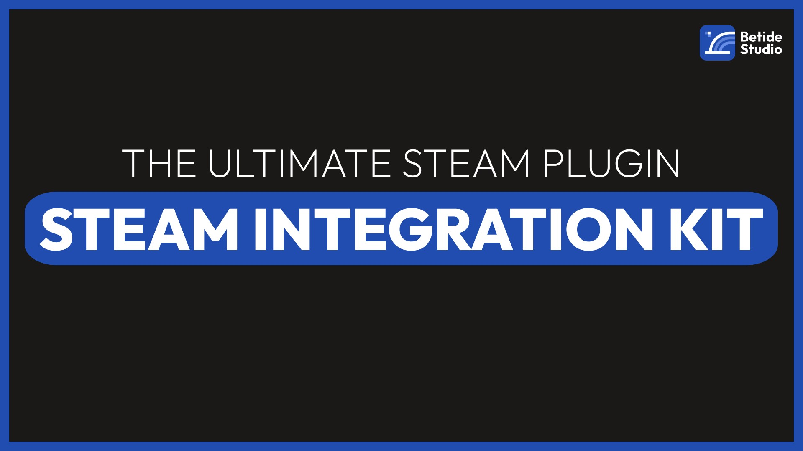

<h1 align="center" id="title">Steam Integration Kit</h1>

  

SIK (Steam Integration Kit) is a plugin that enables seamless integration between Steam and Unreal Engine. The plugin is the ultimate option for steam integration for beginners, and advanced users both, as it has nodes to support both the types! 

- [Discord Support](https://discord.gg/betidestudio)
- [Mail Support](mailto:support@betide.studio)
- [Unreal Engine Marketplace Version](https://www.unrealengine.com/marketplace/en-US/product/steam-integration-kit)

- ✨Staring the repo is always a good thing, for us and you ;)

<h2>🚀 Setup Information</h2>

- [Building from Github](https://youtu.be/ClfForiuUeo)
- [Video Playlist](https://youtu.be/BhjRKwfacyw)
- [Documentation](https://sik.betide.studio)

<h2>🧐 SDK Interfaces Exposed</h2>

- Apps
- Friends
- Game Server
- Game Server Stats
- Inventory
- Input
- Matchmaking
- Matchmaking Servers
- Music
- Music Remote
- Networking
- Networking Utils
- Parties
- Remote Storage
- Screenshots
- User Generated Content (UGC)
- User
- User Stats
- Utils

<h2>🛠️ Installation Steps:</h2>

- Make sure to change `bUseEngineSteam` to true because Marketplace version uses it's own Subsystem and SDK but this uses the Engine's Steam Plugin. It's present in **Source/SteamIntegrationKit/SteamIntegrationKit.Build.cs**.

<h2>🍰 Contribution Guidelines:</h2>

Being a open-source project it's important for the people to contribute to the plugin. Just make sure to write clean code and include all the required headers.
  
<h2>💻 Built with</h2>

Technologies used in the project:

*   Unreal Engine
*   C++

<h2>🛡️ License:</h2>

This project is licensed under the MIT License

